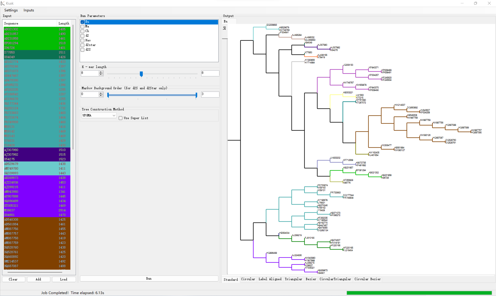
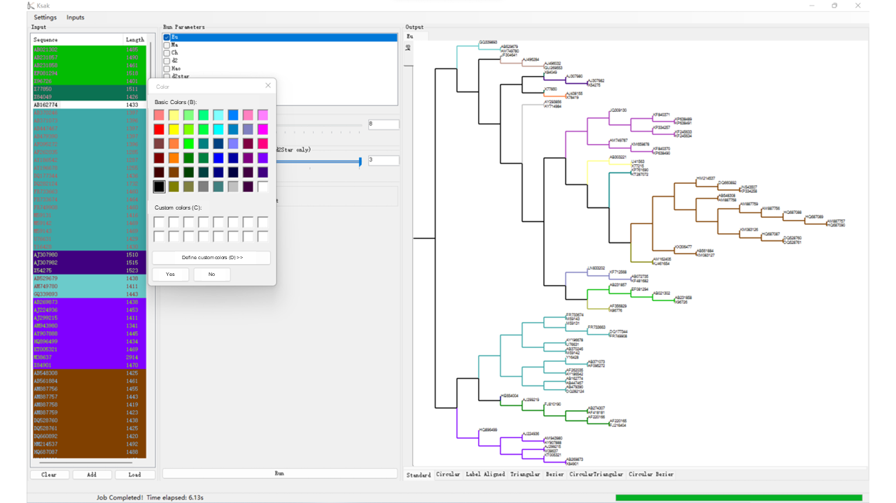
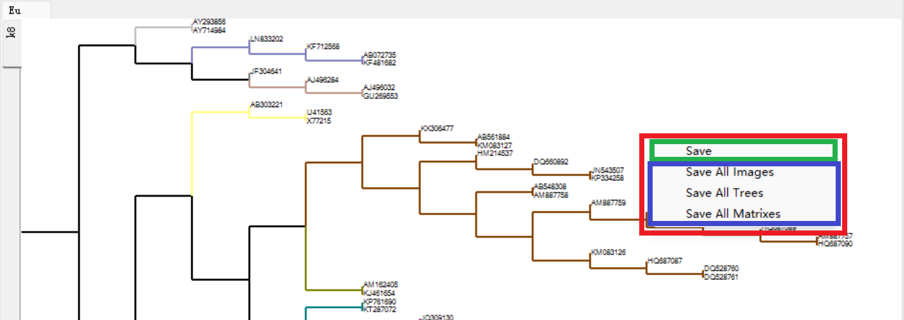
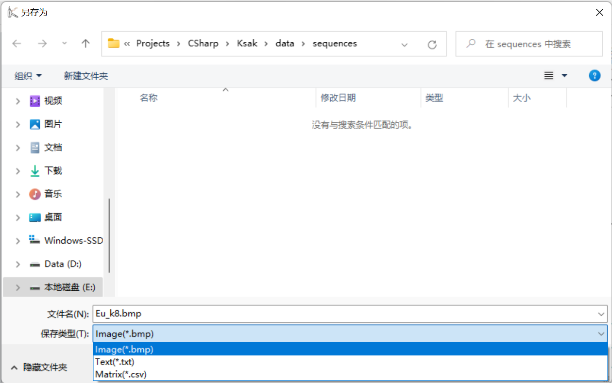
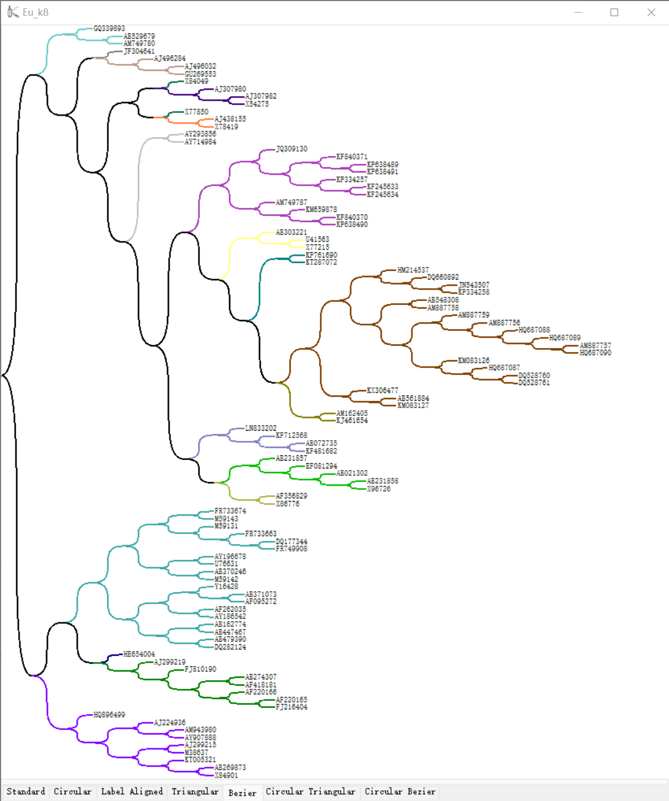
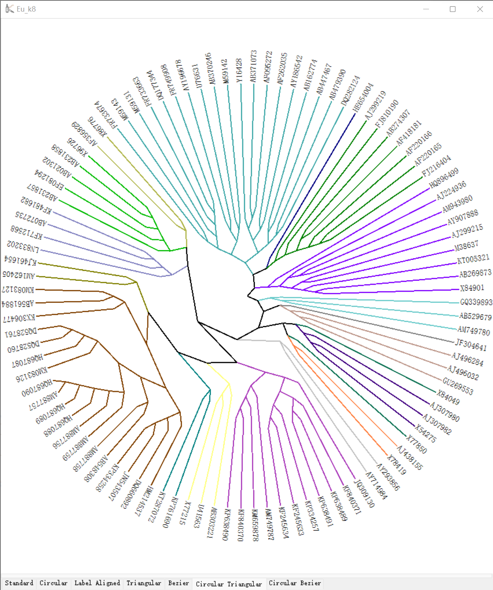

<b> 1. Operating interface of Ksak </b>

The extended software we named Ksak, the background color of the software icon was changed from green to orange, and the interface of the software is shown below.

The red area is the menu area, where you can set the language, graphic font and other information. The yellow area is the input area, where you can view and edit the sequences involved in the comparison. The green area is the configuration area, where you can configure the clustering algorithm, plotting algorithm, etc. The blue area is the output area, where you can view the generated tree and export it here. The purple area is the status area, where you can display the current progress of calculation and plotting.

The software package can compare protein and DNA sequences by clicking Gene and Protein.

The middle column is used to configure the calculation parameters, in Distance column you can configure which distance algorithm is needed for the calculation; in k-string length you can configure the interval information of k-string length; in Malkov model you can configure the interval information of Malkov model; in Draw Method you can configure the clustering algorithm (UPGMA or NJ).

After importing and configuring the sequences, click Generate button to see the software start running. The running progress can be seen in the status bar at the bottom.

After the calculation is complete, the obtained tree is presented on the right side of the software. We can select different results and view them, and we can also view different styles of trees (Standard and Circular).

Right click on the image and in the shortcut menu you can choose Save or Save All ... to export the results (bmp image, tree description file or distance matrix) for that or all plots, respectively. Double click on the image to see it individually in a pop-up box.

In the left column we enter the comparison sequence and run the result as follows, which allows us to export the evolutionary tree directly.

<b>2. Advantages of Ksak</b> 

Multiple windows can be opened for easy comparison from tree to tree.
Very full-featured: Upgrading on Ksak allows you to produce plots, mark colors, and set fonts with one click.

Win. Linux. platform: Has versions for both Windows and Linux platforms.

Time Upgrading: Using the technology of separating interaction and calculation, the efficiency is 20% more efficient on the basis of Ksak.

Language support Chinese and English.

<b>3. Features of Ksak</b>

The software is roughly divided into three columns. The left column is used for input, click the Clear button to clear the input sequence; click Add to import the sequence file by opening the input dialog box as shown in the figure; meanwhile, the Input box also accepts file/folder drag-and-drop operation and will automatically find the fasta format file in the folder to import; double click the sequence file name to view the sequence information.

In addition, we can right click on the sequence name in the shortcut menu to select the sequence color and mark it. The sequences are color categorized before sequence comparison. The output evolution tree is very clear in this way, as follows.

After the software upgrade, Ksak can have two types of clustering output, including UPGMA clustering and NJ clustering. The following figure shows the output results of both clusters.

a) UPGMA clustering; b) NJ clustering

In addition, the output of Ksak can be saved in three ways after the upgrade. The first one is image output, and you can output all the plots under all parameters at once and save them in one folder. The second output is in matrix form, where the results of all runs under all parameters are saved in matrix form and stored in the same folder, and saved in the parameter format. The third output format can be saved as a notepad, where all sequences are output in the format described under different parameters. The three ways are shown in the figure.

For the output results in the form of evolution trees, we can upgrade the output to the following 7 presentation formats. The evolution tree allows us to visualize the different clustering effects and the clustering effect of species.

a) Standard; b) Circular

c) Align Text; d) Triangular

e) Bezier; f) Circular Triangular

g) Circular Bezier

