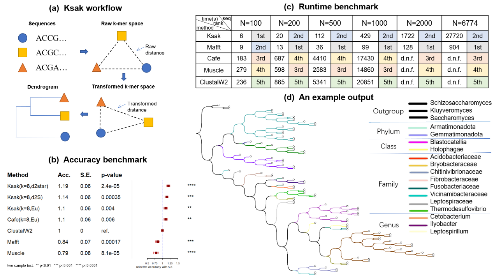
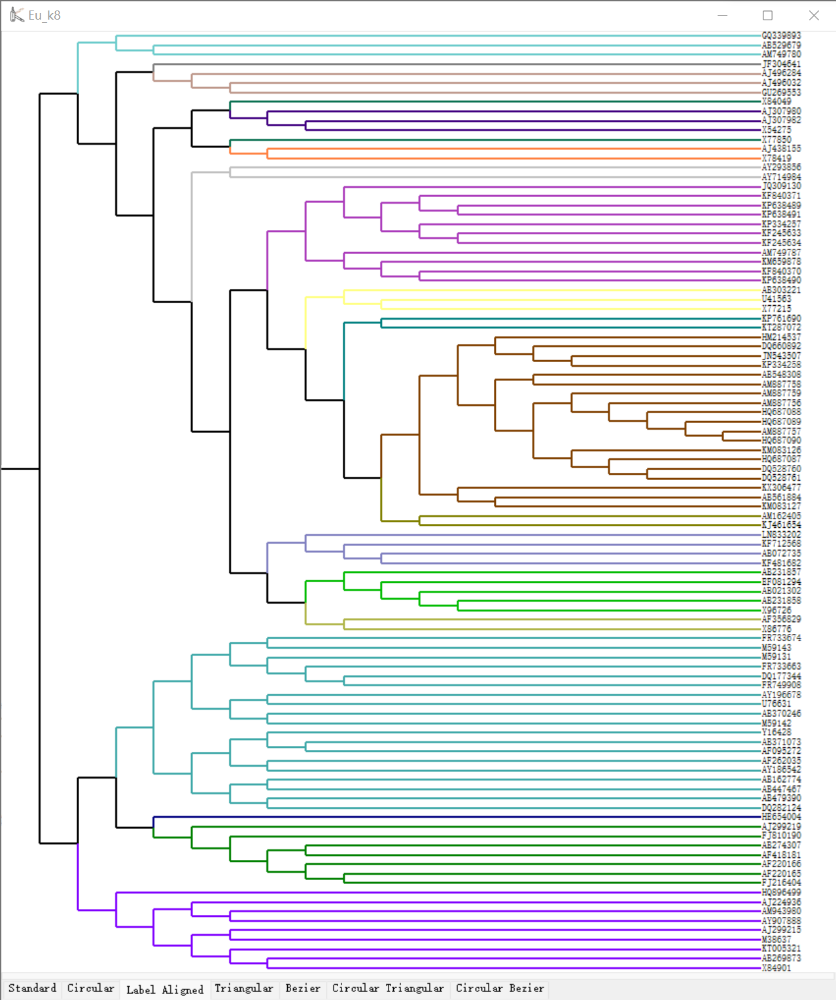

# Ksak: A High-throughput Tool for Alignment-free Phylogenetics

# README

## Introduction

- Phylogenetic analysis is the cornerstone of evolutionary biology and taxonomy. Phylogeny based on molecular sequence similarity has become the de facto standard. All subsequences of size k derived from a molecular sequence, are called its k-mers. Numerous studies demonstrated that k-mers of molecular sequences, such as genomic DNA and proteins, are conserved within closely related organisms, and diverge with speciation (Huan et al., 2015, Yu et al., 2019). Thus k-mer statistics are efficient and effective phylogenetic distance measures (Bussi et al., 2021).

- We developed Ksak - a tool efficiently computes seven widely accepted k-mer statistics: Chebyshev (Ch), Manhattan (Ma), Euclidian (Eu), Hao (Qi et al., 2004), d2, d2S and d2star (Song et al., 2013); and performs alignment-free phylogenetic analysis. Using a golden standard 16S rRNA dataset, we extensively benchmarked the accuracy and efficiency of Ksak, comparing to Muscle (Edgar et al., 2004), ClustalW2 (Panchal et al., 2012) , Mafft (Katoh et al., 2014) and Cafe(Sun et al., 2017) - popular multiple sequence aligners. We made the software of Ksak open source. Ksak runs on MS Windows and Linux operating systems with a graphical user interface for Windows.

Fig. 1. (a) The computation framework of <i>Ksak</i>; (b) Accuracy benchmark results; (c) Efficiency benchmark results; (d) An example phylogeny tree output of <i>Ksak</i>.

## Manual (Windows)

## <b> 1. User interface of <i>Ksak</i> </b>

- The user interface of <i>Ksak</i> is shown below.

- The red area is the menu area, where you can set the language, graphic font and other information. The yellow area is the input area, where you can view and edit the sequences involved in the comparison. The green area is the configuration area, where you can configure the clustering algorithm, plotting algorithm, etc. The blue area is the output area, where you can view the generated tree and export it here. The purple area is the status area, where you can display the current progress of calculation and plotting.

- The software package can compare protein and DNA sequences by clicking <i><u>Gene</u></i> and <i><u>Protein</u></i>.

- The middle column is used to configure the calculation parameters, in <i><u>Distance</u></i> column you can configure which distance algorithm is needed for the calculation; in <i><u>k-string length</u></i> you can configure the interval information of k-string length; in <i><u>Malkov model</u></i> you can configure the interval information of Malkov model; in <i><u>Draw Method</u></i> you can configure the clustering algorithm (UPGMA or NJ).

- After importing and configuring the sequences, click <i><u>Generate</u></i> button to see the software start running. The running progress can be seen in the status bar at the bottom.

- After the calculation is complete, the obtained tree is presented on the right side of the software. We can select different results and view them, and we can also view different styles of trees (Standard and Circular).

- Right click on the image and in the shortcut menu you can choose <i><u>Save</u></i> or <i><u>Save All ...</u></i> to export the results (bmp image, tree description file or distance matrix) for that or all plots, respectively. Double click on the image to see it individually in a pop-up box.

- For example, in the left column we enter the comparison sequence and run the result as follows, which allows us to export the evolutionary tree directly.

## <b> 2. Advantages of <i>Ksak</i></b>

- Multiple windows can be opened for easy comparison from tree to tree.
Very full-featured: Upgrading on <i>Ksak</i> allows you to produce plots, mark colors, and set fonts with one click.

- Win. Linux. platform: Has versions for both Windows and Linux platforms.

- Time Upgrading: Using the technology of separating interaction and calculation, the efficiency is 20% more efficient on the basis of <i>Ksak</i>.

- Language support Chinese and English.

## <b> 3. Features of <i>Ksak</i></b>

- The software is roughly divided into three columns. The left column is used for input, click the <i><u>Clear</u></i> button to clear the input sequence; click <i><u>Add</u></i> to import the sequence file by opening the input dialog box as shown in the figure; meanwhile, the <i><u>Input</u></i> box also accepts file/folder drag-and-drop operation and will automatically find the fasta format file in the folder to import; double click the sequence file name to view the sequence information.

- In addition, we can right click on the sequence name in the shortcut menu to select the sequence color and mark it. The sequences are color categorized before sequence comparison. The output evolution tree is very clear in this way, as follows.

- After the software upgrade, <i>Ksak</i> can have two types of clustering output, including UPGMA clustering and NJ clustering. The following figure shows the output results of both clusters.

### a) UPGMA clustering

### b) NJ clustering

- In addition, the output of <i>Ksak</i> can be saved in three ways after the upgrade. The first one is image output, and you can output all the plots under all parameters at once and save them in one folder. The second output is in matrix form, where the results of all runs under all parameters are saved in matrix form and stored in the same folder, and saved in the parameter format. The third output format can be saved as a notepad, where all sequences are output in the format described under different parameters. The three ways are shown in the figure.

- For the output results in the form of evolution trees, we can upgrade the output to the following 7 presentation formats. The evolution tree allows us to visualize the different clustering effects and the clustering effect of species.

### a) Standard

### b) Circular

### c) Align Text

### d) Triangular

### e) Bezier

### f) Circular Triangular

### g) Circular Bezier

## <b>Reference:</b>

Lu, Y.Y., Tang, K., et al. (2017) CAFE: accelerated Alignment-Free sequence analysis. Nucleic Acids Res.45,W554-W559.

Edgar, R.C. (2004) MUSCLE: a multiple sequence alignment method with re-duced time and space complexity. BMC Bioinformatics, 5, 113.

Patel, S., Panchal, H. and Anjaria, K. (2012) Phylogenetic analysis of some legu-minous trees using CLUSTALW2 bioinformatics tool. Bioinformatics and Bio-medicine Workshops (BIBMW), 917–921.

Katoh, K. (2014) MAFFT: iterative refinement and additional methods. Methods Mol. Biol., 1079, 131–146.

Lu, Y.Y., Tang, K., et al. (2017) CAFE: accelerated Alignment-Free sequence analysis. Nucleic Acids Res.45,W554-W559.

# <b>Contact & Support:</b>

- Li C. Xia: email: lcxia@scut.edu.cn

- Ziqi Cheng: email: php@mail.scut.edu.cn
